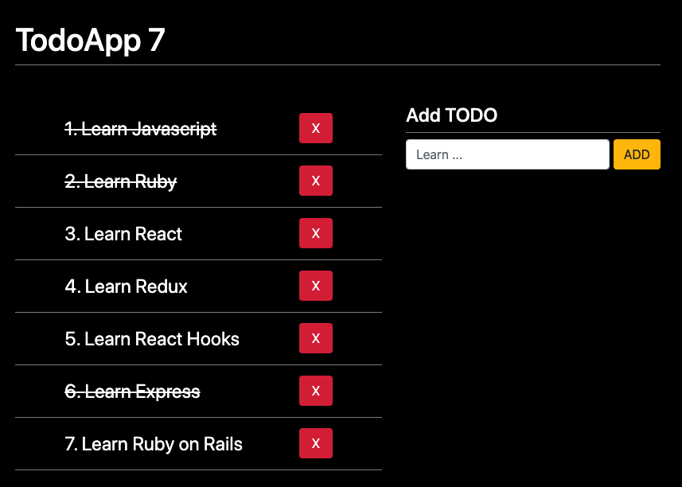

# Hooks

- [The Breaking Bad API][breakingbadapi]

#### Hooks
- [useLayoutEffect][uselayouteffect]
- [useReducer][usereducer]

#### React Router
- [React Router - Quick Start] [react_touter_quik_start]
- [React Router - <NavLink>][react_router_nav_link]

#### Tests
- [Enzyme][enzymejs]
- [enzyme-to-json][enzyme_to_json]
- [React Hooks Testing Library][react_hooks_testing]

[breakingbadapi]: https://breakingbadapi.com/documentation

[uselayouteffect]: https://es.reactjs.org/docs/hooks-reference.html#uselayouteffect
[usereducer]: https://es.reactjs.org/docs/hooks-reference.html#usereducer

[react_touter_quik_start]: https://reacttraining.com/react-router/web/guides/quick-start
[react_router_nav_link]: https://reacttraining.com/react-router/web/api/NavLink

[enzymejs]: https://enzymejs.github.io/enzyme/
[enzyme_to_json]: https://www.npmjs.com/package/enzyme-to-json
[react_hooks_testing]: https://react-hooks-testing-library.com/

### Installs

With `package.json` and dependencies
```shell
docker-compose run app yarn
```

without dependencies
```shell
docker-compose run app yarn add react-router-dom
docker-compose run app yarn add enzyme enzyme-adapter-react-16 --dev
docker-compose run app yarn add @testing-library/react-hooks --dev
```

### Project Structure

> run `tree -I "node_modules|public"`
```shell
.
├── Dockerfile
├── README.md
├── docker-compose.yml
├── package.json
├── src
│   ├── HookApp.js
│   ├── components
│   │   ├── 01-useState
│   │   │   ├── CounterApp.js
│   │   │   ├── CounterWithCustomHook.js
│   │   │   └── counter-app.css
│   │   ├── 02-useEffect
│   │   │   ├── FormWithCustomHook.js
│   │   │   ├── Message.js
│   │   │   ├── SimpleForm.js
│   │   │   └── effects.css
│   │   ├── 03-examples
│   │   │   ├── MultipleCustomHooks.js
│   │   │   └── hooks.css
│   │   ├── 04-useRef
│   │   │   ├── FocusScreen.js
│   │   │   ├── RealExampleRef.js
│   │   │   └── focus.css
│   │   ├── 05-useLayoutEffect
│   │   │   ├── Layout.js
│   │   │   └── layout.css
│   │   ├── 06-memos
│   │   │   ├── CallbackHook.js
│   │   │   ├── MemoHook.js
│   │   │   ├── Memorize.js
│   │   │   ├── ShowIncrement.js
│   │   │   ├── Small.js
│   │   │   └── memo.css
│   │   ├── 07-tarea-memo
│   │   │   ├── Hijo.js
│   │   │   ├── Padre.js
│   │   │   └── styles.css
│   │   └── 08-useReducer
│   │       ├── TodoAdd.js
│   │       ├── TodoApp.js
│   │       ├── TodoList.js
│   │       ├── TodoListItem.js
│   │       ├── intro-reducer.js
│   │       ├── styles.css
│   │       └── todoReducer.js
│   ├── helpers
│   │   └── heavyProcess.js
│   ├── hooks
│   │   ├── useCounter.js
│   │   ├── useFetch.js
│   │   └── useForm.js
│   └── index.js
└── yarn.lock

12 directories, 41 files
```

### Screenshots

#### TODO List with hooks

<p align="center">
  <kbd>
    
  </kbd>
</p>

### Start project

> run `docker-compose up`

